# 1. Introduction

**Snickr** is a Slack-like collaboration platform.  Users sign up,
create *workspaces*, organise conversations into *channels* of three
visibilities (`public`, `private`, `direct`), and post *messages*
inside those channels.  This document covers part 1: the
relational database that backs the system.

# 2. Design assumptions

The schema was shaped by the following decisions.

1. **Surrogate integer keys** (`user_id`, `workspace_id`, …) on every
   table, with UNIQUE constraints on the natural keys (`email`,
   `username`, workspace name, channel name).  This lets the natural
   attributes change without breaking foreign keys.
2. **Workspace administrators are a role**, not a separate entity:
   a boolean `is_admin` flag on `workspace_members` keeps the schema
   compact.
3. **All channel types share one table** (`channels.type IN
   ('public','private','direct')`).  Direct channels use a synthetic
   name such as `dm:alice-carol`.  Membership is handled uniformly
   through `channel_members`, so messages, listings, and search work
   without per-type special cases.
4. **Invitations are first-class objects** with a `status`
   (`pending` / `accepted` / `declined`) and a time stamp.  They
   survive even after the invitee joins or refuses, which is what
   makes Query #4 ("invited > 5 days ago, not joined") possible.
5. **Workspace invitations may target unregistered emails**, so
   `workspace_invitations.invitee_email` is `NOT NULL` while
   `invitee_id` is nullable until the address is linked to an
   account.  Channel invitations always reference an existing user.
6. **All actions carry a `TIMESTAMPTZ`** (`created_at`, `joined_at`,
   `invited_at`, `posted_at`).  The system can therefore present
   sortable history and answer time-based questions.
7. **Access control lives in the application layer.**  Per the
   project guidelines we do *not* use database roles, views, or
   row-level security; every query joins through the membership
   tables to filter rows the user is not allowed to see (Query #7).

# 3. ER diagram

The conceptual model contains 8 entities.  `WORKSPACE_MEMBERS` and
`CHANNEL_MEMBERS` materialise the N:M relationships between users
and workspaces / channels; the two `*_INVITATIONS` tables record the
history of invitations.  A user has *three* roles relative to an
invitation (sender, receiver, and — when the invite is for a
workspace — possibly already-registered invitee), all modelled as
foreign keys.

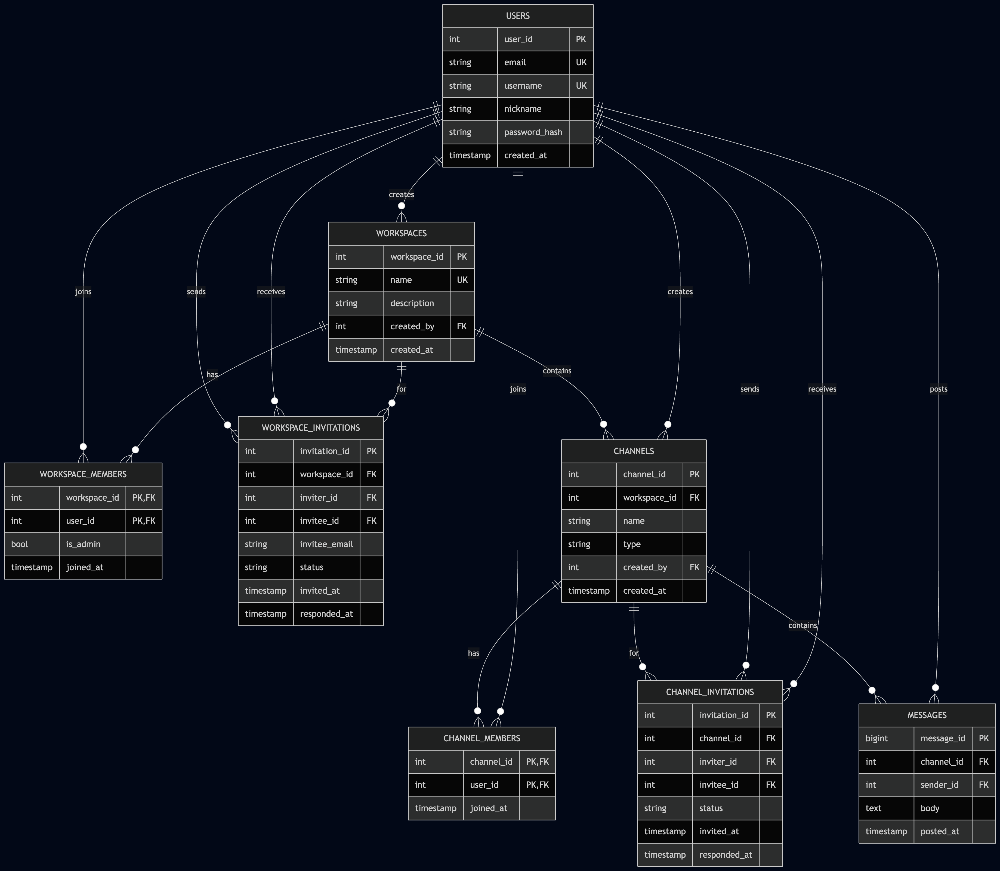

| Relationship                              | Cardinality                |
|-------------------------------------------|----------------------------|
| USERS — creates — WORKSPACES              | 1 : N                      |
| USERS ⟷ WORKSPACES                        | N : M (`workspace_members`)|
| WORKSPACES — contains — CHANNELS          | 1 : N                      |
| USERS ⟷ CHANNELS                          | N : M (`channel_members`)  |
| USERS — sends/receives — *_INVITATIONS    | 1 : N (each side)          |
| CHANNELS — contains — MESSAGES            | 1 : N                      |
| USERS — posts — MESSAGES                  | 1 : N                      |

# 4. Relational schema

Full DDL is in `sql/01_schema.sql`.  Eight tables plus four explicit
indexes; everything is created by one transactional script.

| Table                   | Primary key                          | Notable constraints |
|-------------------------|--------------------------------------|---------------------|
| `users`                 | `user_id` (SERIAL)                   | UNIQUE on `email`, `username`; CHECK on email format |
| `workspaces`            | `workspace_id` (SERIAL)              | UNIQUE on `name`; FK `created_by → users` |
| `workspace_members`     | (`workspace_id`,`user_id`)           | `is_admin` flag; CASCADE on both FKs |
| `workspace_invitations` | `invitation_id` (SERIAL)             | `status` CHECK; UNIQUE(`workspace_id`,`invitee_email`,`status`) |
| `channels`              | `channel_id` (SERIAL)                | `type` CHECK; UNIQUE(`workspace_id`,`name`) |
| `channel_members`       | (`channel_id`,`user_id`)             | CASCADE on both FKs |
| `channel_invitations`   | `invitation_id` (SERIAL)             | `status` CHECK; UNIQUE(`channel_id`,`invitee_id`,`status`) |
| `messages`              | `message_id` (BIGSERIAL)             | `body` non-empty CHECK; index on (`channel_id`,`posted_at`) |

Key constraint choices:

* **`ON DELETE CASCADE`** on every dependent membership / message
  table so removing a workspace, channel or user automatically
  cleans up the orphans.
* **`ON DELETE RESTRICT`** on `messages.sender_id`,
  `workspaces.created_by`, `channels.created_by` so historical
  authorship cannot vanish silently.
* **`ON DELETE SET NULL`** on `workspace_invitations.invitee_id`:
  if the invitee deletes their account the invitation row is kept
  for audit purposes but the FK is cleared.
* **UNIQUE on invitations** prevents duplicate active invites for
  the same recipient.

After running `01_schema.sql` in pgAdmin the *Messages* panel
confirms a clean load:

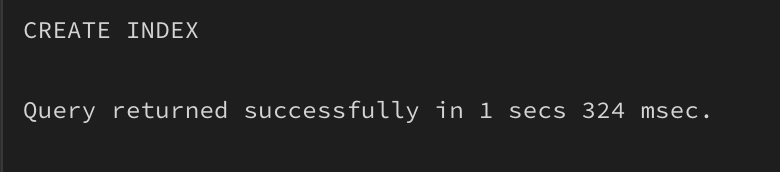

# 5. Sample data

Hand-crafted to exercise every required query without inflation: 6
users, 2 workspaces, 7 channels, 3 workspace invitations, 5 channel
invitations, 15 messages.  Full script in `sql/02_sample_data.sql`.

```text
USERS                                 WORKSPACES
alice  – admin of W1, member of W2    W1: NYU Faculty
bob    – admin of W1                  W2: Coop Board
carol  – member of W1
david  – member of W1
eve    – admin of W2
frank  – signed up but no workspaces

W1 channels:                          W2 channels:
  #general          public            #general   public  – eve, alice
  #grad-admissions  public            #budget    public  – eve  (alice NOT in)
  #undergrad-edu    public
  #hiring           private
  dm:alice-carol    direct
```

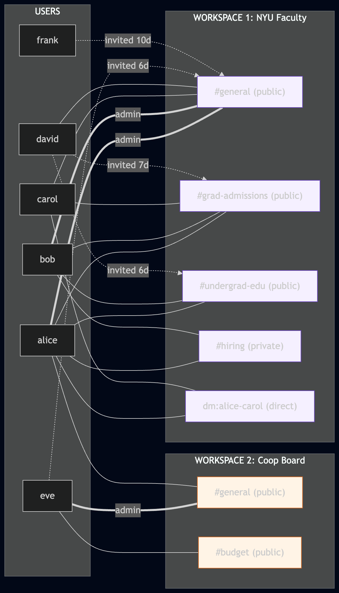

The data was designed so that the following corner cases all show up
at once:

* "perpendicular" appears in **5** messages spread across public,
  private, and the `#budget` channel that alice cannot see — Query #7
  must include and exclude the right rows simultaneously.
* `#grad-admissions` has both an *accepted* (carol, 9 d) and a
  *pending* (david, 7 d) invitation; only the latter must be counted
  by Query #4.
* `#undergrad-edu` has an *old* pending (david, 6 d — counted) and a
  *recent* pending (carol, 3 d — **not** counted), proving the 5-day
  threshold is enforced.
* Workspace invitations include both an existing user (eve) and an
  unregistered email (`frank@coop.com`), exercising the
  `invitee_id` / `invitee_email` design.

After loading, the script commits cleanly:

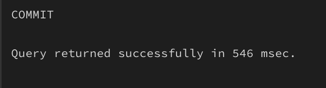

# 6. Required SQL queries and results

The seven queries are taken verbatim from `sql/03_queries.sql`
(placeholder version).  The screenshots come from running the
fully-substituted version in `sql/04_test_queries.sql` inside
pgAdmin 4.

## 6.1 Query 1

```sql
INSERT INTO users (email, username, nickname, password_hash)
VALUES (:'email', :'username', :'nickname', :'password_hash')
RETURNING user_id, email, username, nickname, created_at;
```

Test: created `grace@nyu.edu`.  The UNIQUE constraints on `email`
and `username` reject any duplicate re-run.

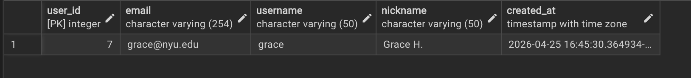

## 6.2 Query 2

```sql
BEGIN;
WITH new_channel AS (
    INSERT INTO channels (workspace_id, name, type, created_by)
    SELECT :workspace_id, :'channel_name', 'public', :user_id
    WHERE EXISTS (
        SELECT 1 FROM workspace_members
        WHERE workspace_id = :workspace_id
          AND user_id      = :user_id
    )
    RETURNING channel_id, workspace_id, name, type, created_by, created_at
)
INSERT INTO channel_members (channel_id, user_id)
SELECT channel_id, :user_id FROM new_channel;
COMMIT;
```

The `WHERE EXISTS` inside the `INSERT … SELECT` performs the
authorisation check atomically: if the caller is not a workspace
member the CTE returns zero rows and the membership insert sees
nothing either.

**Test 2a** — alice (member of NYU Faculty) creates `#random` →
one channel + one membership row inserted.

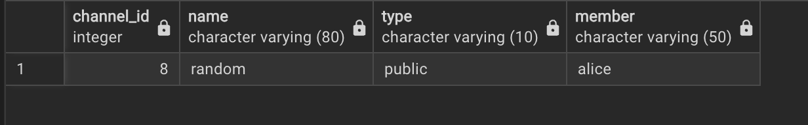

**Test 2b** — frank (NOT a member) tries to create `#spam` → zero
rows inserted; the verifying `SELECT count(*) … name='spam'` confirms.

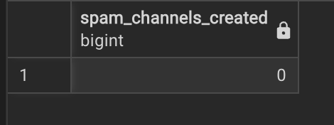

## 6.3 Query 3

```sql
SELECT  w.workspace_id, w.name AS workspace_name,
        u.user_id  AS admin_user_id,
        u.username AS admin_username,
        u.nickname AS admin_nickname
FROM    workspaces        w
JOIN    workspace_members wm ON wm.workspace_id = w.workspace_id
JOIN    users             u  ON u.user_id       = wm.user_id
WHERE   wm.is_admin = TRUE
ORDER BY w.workspace_id, u.username;
```

NYU Faculty has two admins (alice, bob), Coop Board has one (eve).

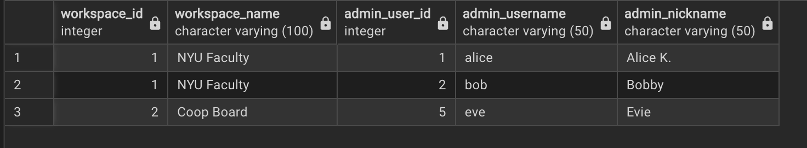

## 6.4 Query 4

```sql
SELECT  c.channel_id, c.name AS channel_name,
        COUNT(*) FILTER (
            WHERE ci.invitation_id IS NOT NULL
              AND ci.invited_at < NOW() - INTERVAL '5 days'
              AND NOT EXISTS (
                    SELECT 1 FROM channel_members cm
                    WHERE cm.channel_id = c.channel_id
                      AND cm.user_id    = ci.invitee_id
              )
        ) AS pending_invites_older_than_5_days
FROM    channels c
LEFT JOIN channel_invitations ci ON ci.channel_id = c.channel_id
WHERE   c.workspace_id = :workspace_id
  AND   c.type         = 'public'
GROUP BY c.channel_id, c.name
ORDER BY c.name;
```

The `LEFT JOIN` keeps channels with zero invitations.  The
`COUNT(*) FILTER (…)` aggregate counts only invitations that are
old enough *and* whose invitee has not joined yet.

For `NYU Faculty`: `general` 0, `grad-admissions` 1 (david, 7 d),
`random` 0, `undergrad-edu` 1 (david, 6 d).  The carol invitation
to `undergrad-edu` is correctly excluded because it is only 3 days
old.

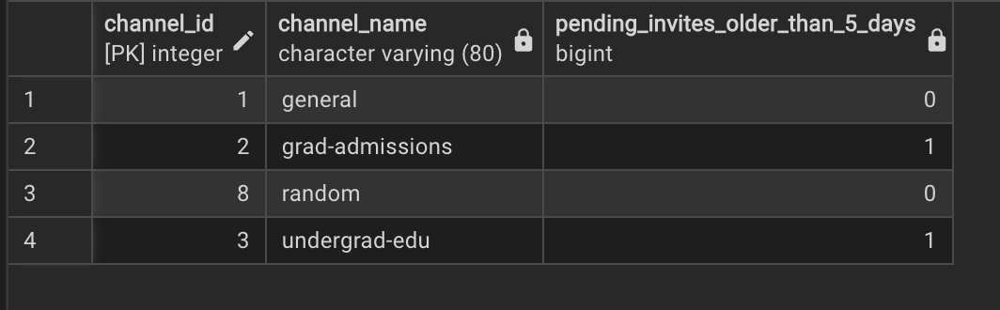

## 6.5 Query 5

```sql
SELECT  m.message_id, m.posted_at,
        u.username AS sender_username, u.nickname AS sender_nickname,
        m.body
FROM    messages m
JOIN    users    u ON u.user_id = m.sender_id
WHERE   m.channel_id = :channel_id
ORDER BY m.posted_at ASC, m.message_id ASC;
```

For `#grad-admissions` in NYU Faculty — two posts, in order.

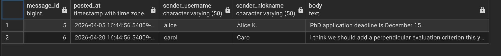

## 6.6 Query 6

```sql
SELECT  m.message_id, m.posted_at,
        w.name AS workspace_name,
        c.name AS channel_name, c.type AS channel_type,
        m.body
FROM    messages   m
JOIN    channels   c ON c.channel_id   = m.channel_id
JOIN    workspaces w ON w.workspace_id = c.workspace_id
WHERE   m.sender_id = :user_id
ORDER BY m.posted_at ASC, m.message_id ASC;
```

For alice — six rows covering every channel type (public, private,
direct) across both workspaces.

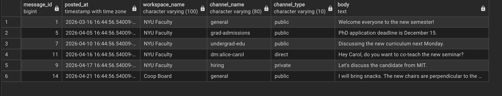

## 6.7 Query 7

```sql
SELECT  m.message_id, m.posted_at,
        w.name AS workspace_name,
        c.name AS channel_name, c.type AS channel_type,
        sender.username, m.body
FROM    messages   m
JOIN    channels   c       ON c.channel_id   = m.channel_id
JOIN    workspaces w       ON w.workspace_id = c.workspace_id
JOIN    users      sender  ON sender.user_id = m.sender_id
WHERE   m.body ILIKE '%perpendicular%'
  AND   EXISTS (SELECT 1 FROM channel_members cm
                WHERE cm.channel_id = c.channel_id
                  AND cm.user_id    = :user_id)
  AND   EXISTS (SELECT 1 FROM workspace_members wm
                WHERE wm.workspace_id = w.workspace_id
                  AND wm.user_id      = :user_id);
```

The two `EXISTS` clauses encode the access rule from the
specification exactly: the caller must be a member of *both* the
channel and its parent workspace.  `ILIKE` makes the keyword search
case-insensitive.

**For alice** — four hits.  eve's `#budget` message is correctly
hidden because alice is not a member of that channel.

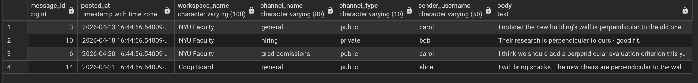

**For eve** — two hits (her own `#budget` post and alice's
`Coop Board #general` post).  All NYU Faculty perpendicular
messages disappear because eve is not in NYU Faculty.

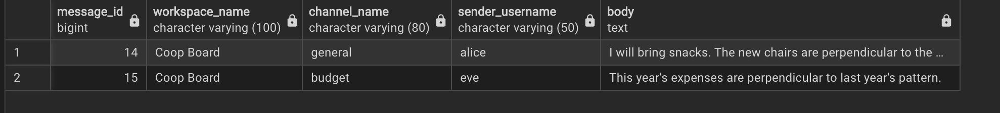

These two results, taken side by side, prove that application-level
access control is correctly enforced by the query alone, without
any view or DBMS-side privilege.

# 7. File index

| File                              | Purpose                                                |
|-----------------------------------|--------------------------------------------------------|
| `sql/01_schema.sql`               | DDL: 8 tables, indexes, all constraints               |
| `sql/02_sample_data.sql`          | Hand-crafted test data                                 |
| `sql/03_queries.sql`              | The 7 required queries, with placeholders              |
| `sql/04_test_queries.sql`         | The same queries with concrete values, for screenshots |
| `report/er_diagram.mmd`           | Mermaid source for the ER diagram                      |
| `report/test_data_diagram.mmd`    | Mermaid source for the sample-data overview            |
| `report/report.md`                | This document                                          |
| `screenshots/`                    | All pgAdmin screenshots embedded above                 |
